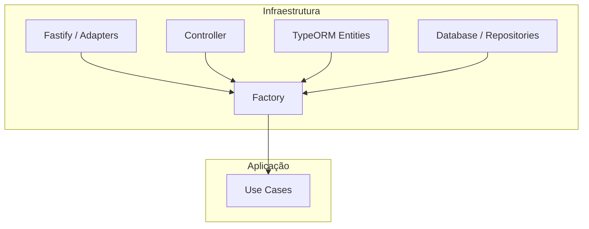

# Arquitetura do Projeto - AgendaOk

Este documento descreve a organização e os princípios arquiteturais seguidos no desenvolvimento do **AgendaOk**. O projeto utiliza uma abordagem pragmática baseada em **Ports and Adapters**, focada em produtividade com TypeORM.

## 1. Visão Geral das Camadas

A estrutura é dividida entre lógica de aplicação (`usecase`) e detalhes técnicos de infraestrutura (`infra`).

### 📂 `src/usecase` (Aplicação)
- **Coração da Lógica**: Contém a lógica de negócio específica da aplicação (Interactors).
- Orquestra como os dados são processados e manipulados através de interfaces (**Ports**).
- Exemplo: `SyncCalendarUseCase`, `GenerateGoogleAuthUrlUseCase`.

### 📂 `src/infra` (Infraestrutura)
- **O Mundo Externo e Dados**: Implementações técnicas e persistência.
    - **database/entities/**: Contém as entidades do TypeORM (Modelos do Banco).
        - `User`, `Client`, `Schedule`, `UserConfig`.
        - `Subscription`: Dados da assinatura PRO atual.
        - `SubscriptionPayment`: Histórico detalhado de pagamentos e cobranças.
    - **database/repositories/**: Contém as implementações concretas de persistência de dados.
    - **adapters/**: Adaptadores para bibliotecas externas (ex: `FastifyAdapter`, `GoogleCalendarAdapter`, `AbacatePayAdapter`).
    - **controller/**: Porta de entrada para requisições externas (HTTP/REST).
    - **factory/**: **Composition Root**. Centraliza a instanciação e a injeção de dependências.
    - **config/**: Configurações de ambiente, flags de debug e segredos.

---

## 2. Injeção de Dependências & Lazy Loading (Factory)

Para evitar erros de inicialização (como o famoso "No metadata for [Entity] was found"), utilizamos um padrão de **Lazy Loading Factory** em `src/infra/factory/factory.ts`.

1. **Singleton Adapters**: Adaptadores que não dependem do banco (ex: Fastify, Google, Evolution) são instanciados imediatamente.
2. **Lazy Accessors**: Repositórios e Use Cases que dependem do TypeORM são encapsulados em funções (getters). 
3. **Delayed Instantiation**: O Repositório só é criado (`new Repository()`) no momento em que é acessado pela primeira vez, garantindo que o `AppDataSource` já esteja inicializado.
4. **Circular Dependency Proof**: O uso de funções para acesso permite que a `factory` resolva dependências sem problemas de ordem de definição.

---

## 3. Fluxo de Inicialização (Bootstrap)

O ciclo de vida da aplicação segue uma sequência rigorosa em `src/bootstrap.ts`:

1. **Database Initialize**: `await AppDataSource.initialize()` é chamado primeiro.
2. **Adapter Setup**: `await adapter.setup()` configura o Fastify, Swagger, JWT e CORS.
3. **Controller Registration**: Os controladores são instanciados via `factory`, o que registra todas as rotas no Fastify.
4. **Worker Initialization**: Os workers do BullMQ são iniciados.
5. **Listen**: O servidor começa a ouvir requisições.

---

## 4. Evolução do Banco de Dados (Migrations)

O projeto utiliza **Migrations** para qualquer alteração no esquema do banco de dados (DDL). 

- **Geração**: Use sempre `typeorm migration:generate` para criar novas migrations baseadas nas entidades.
- **Execução**: As migrations são executadas automaticamente no `bootstrap` através de `AppDataSource.runMigrations()`.
- **Regra de Ouro**: Nunca utilize `synchronize: true` em nenhum ambiente. Toda alteração de tabela deve ser rastreável via arquivo de migration na pasta `src/migrations`.

---

## 4. API Routing & Middleware

- **Prefixo de Rota**: Todas as rotas de API são automaticamente prefixadas com `/api` pelo `FastifyAdapter`.
- **Autenticação**: 
    - `addRoute`: Rota pública.
    - `addProtectedRoute`: Rota que exige cabeçalho `Authorization: Bearer <JWT>`.
- **Middleware de Assinatura**: Algumas rotas protegem recursos PRO através do `subscriptionMiddleware`, que verifica o status do usuário no banco.

---

## 5. Frontend & Shared Schemas

- **Shared Core**: Localizado em `/shared`, contém os schemas **Zod** utilizados tanto pelo Backend (validação de request) quanto pelo Frontend (formulários e tipos).
- **Consumo de API**: Realizado via `api-client.ts`, centralizando o tratamento de tokens e baseURL.

---

## 6. Arquitetura Frontend

O frontend segue um padrão de separação de responsabilidades para manter os componentes React focados em UI:

1. **UI Components (`web/src/pages/`)**: Componentes "burros" que apenas renderizam dados e reagem a eventos do usuário.
2. **Hooks / Interactors (`web/src/features/*/hooks/`)**: Concentram a lógica de negócio do frontend. Orquestram estados complexos, consultas (React Query), polling e efeitos colaterais (toasts, navegação).
3. **Services (`web/src/features/*/services/`)**: Adaptadores para a API, responsáveis apenas por chamadas HTTP e transformações de dados brutas.
4. **Shared Utils (`web/src/shared/utils/`)**: Utilitários globais de formatação (ex: `formatters.ts`) e ajudantes transversais.

