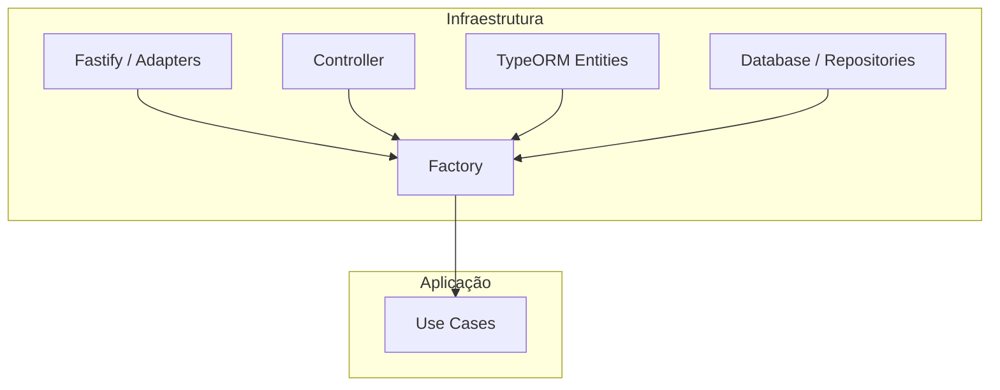

# Arquitetura do Projeto - AgendaOk

Este documento descreve a organização e os princípios arquiteturais seguidos no desenvolvimento do **AgendaOk**. O projeto utiliza uma abordagem pragmática baseada em **Ports and Adapters**, focada em produtividade com TypeORM.

## 1. Visão Geral das Camadas

A estrutura é dividida entre lógica de aplicação (`usecase`) e detalhes técnicos de infraestrutura (`infra`).

### 📂 `src/usecase` (Aplicação)
- **Coração da Lógica**: Contém a lógica de negócio específica da aplicação (Interactors).
- Orquestra como os dados são processados e manipulados.
- Utiliza as entidades do banco de dados para realizar as operações.
- Exemplo: `ProcessCalendarEvent`, `ConfirmAppointment`.

### 📂 `src/infra` (Infraestrutura)
- **O Mundo Externo e Dados**: Implementações técnicas e persistência.
    - **database/entities/**: Contém as entidades do TypeORM (Modelos do Banco).
    - **database/repositories/**: Contém as implementações concretas de persistência de dados.
    - **adapters/**: Adaptadores para bibliotecas externas (ex: `FastifyAdapter`, `GoogleCalendarAdapter`).
    - **controller/**: Porta de entrada para requisições externa (HTTP/REST).
    - **factory/**: **Composition Root**. Centraliza a instanciação e a injeção de dependências.
    - **config/**: Configurações de ambiente, flags de debug e segredos.

---

## 2. Padrão de Injeção de Dependências (Factory)

Para manter o desacoplamento entre a infraestrutura e a lógica, utilizamos um padrão de **Factory** em `src/infra/factory/factory.ts`.

1. A `factory` conhece todas as implementações concretas da `infra`.
2. Ela instancia os adaptadores e serviços necessários.
3. Ela injeta as dependências nos controladores e use cases.
4. O código de inicialização (`bootstrap.ts`) utiliza apenas a `factory` para subir o sistema.

---

## 3. Fluxo de Inicialização

O ciclo de vida da aplicação começa em `src/bootstrap.ts`:

1. Carrega as variáveis de ambiente (`dotenv`).
2. Inicializa a conexão com o banco de dados (`AppDataSource`).
3. Chama a `factory` para instanciar a aplicação.
4. Registra as rotas e inicia o servidor (`listen`).

---

## 4. Fluxo de uma Requisição (Request Flow)

1. **Cliente** faz uma requisição (ex: Webhook do Google ou WhatsApp).
2. **FastifyAdapter** recebe a requisição e encaminha para o **Controller**.
3. **Controller** extrai os dados e invoca o **UseCase** correspondente.
4. **UseCase** executa a lógica de negócio interagindo com as **Entities** no `infra/database`.
5. O resultado é devolvido pelo **Controller** formatado para o cliente.

